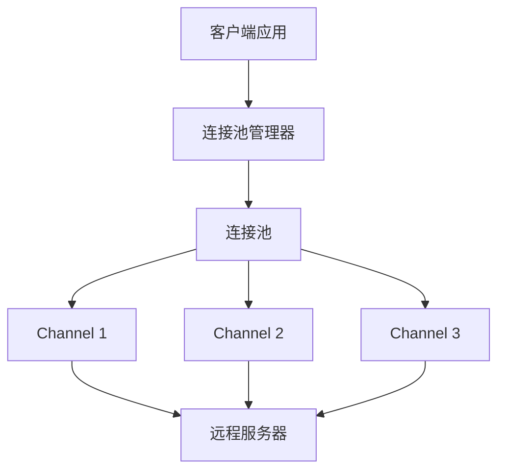

### 一、连接池管理

```mermaid
graph TD
    A[客户端应用] --> B[连接池管理器]
    B --> C[连接池]
    C --> D1[Channel 1]
    C --> D2[Channel 2]
    C --> D3[Channel 3]
    D1 --> E[远程服务器]
    D2 --> E
    D3 --> E
```
